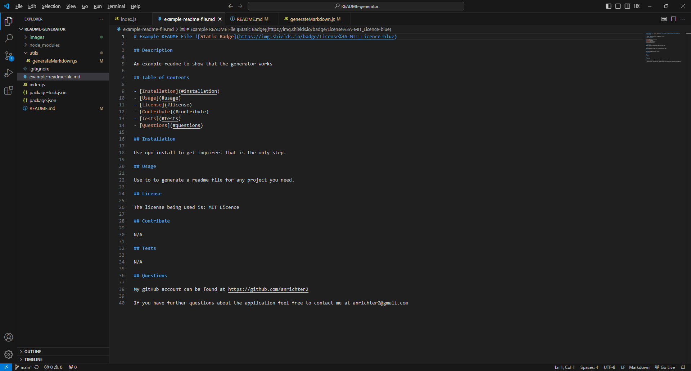

# README-generator

## Description

For this project the ultimate goal was to create a README file generator that could be used to create README files for other projects.

## Installation

Open the terminal and run npm install so that you get the inquirer dependency to load up. From there the application should run.

## Usage

After installing inquirer you type node index.js into the terminal, and the terminal will ask a series of questions that will generate the README file.

Below are screenshots showing a generated README file.

Link to a walkthrough video showing the application in action:
[Walkthrough Video](https://drive.google.com/file/d/1WzPjtTJhTedIqamwJIJzYm1Ed1ibEh2j/view?usp=sharing)

## Credits

N/A

## License

N/A

## Contribute

N/A
